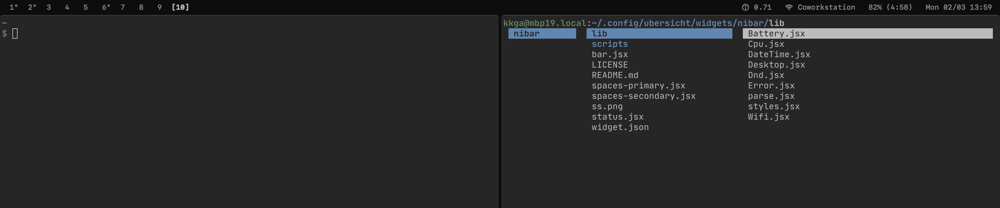

# hellobar

Simple [Übersicht](https://github.com/felixhageloh/uebersicht) widget status bar with [yabai](https://github.com/koekeishiya/yabai) support.

Originally forked from https://github.com/kkga/nibar. Tweaked it to match my preference.

## Screenshot



## Installation

Clone this repo to your Übersicht widgets directory.

```bash
$ git clone https://github.com/kkoscielniak/hellobar $HOME/Library/Application\ Support/Übersicht/widgets/hellobar
```

## Dependencies

- [jq](https://github.com/stedolan/jq) — used for parsing json output and displaying the workspaces widget
    - install with homebrew: `brew install jq`
- [tba]

## Usage

### Refreshing yabai workspaces widget

The widgets for displaying yabai workspaces aren't refreshing automatically (to preserve battery). To refresh them, you can add these lines utilizing [yabai's signals](https://github.com/koekeishiya/yabai/wiki/Commands#automation-with-rules-and-signals) at the end of `.yabairc`:

```sh
yabai -m signal --add event=space_changed \
    action="osascript -e 'tell application \"Übersicht\" to refresh widget id \"hellobar-spaces-jsx\"'"
```
